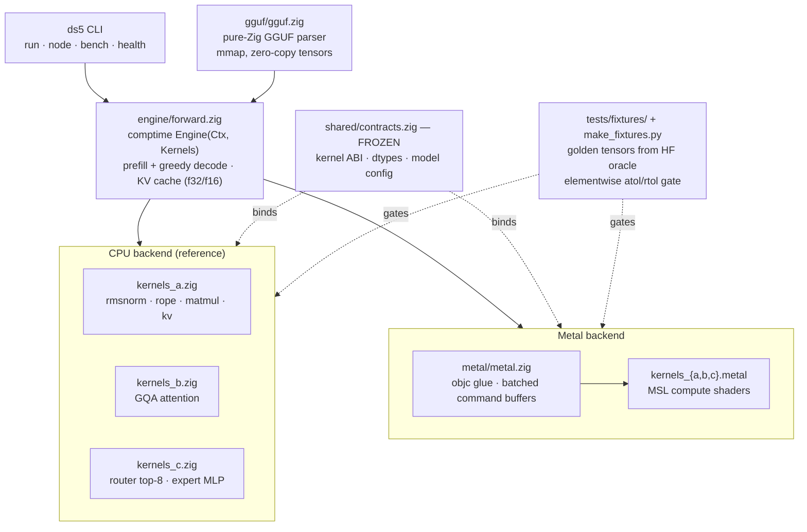
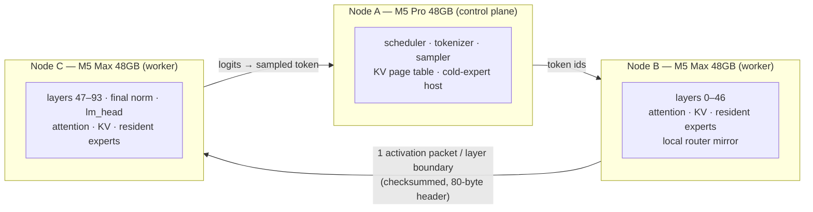

<div align="center">

# DS5

**A from-scratch, model-specific LLM inference engine for Apple Silicon — written in Zig and Metal, with libc as its only dependency.**

[](https://ziglang.org)
[](#quickstart)
[](docs/decisions/ADR_001_Model_Selection_Qwen3_235B_A22B.md)
[](LICENSE)
[](#status-what-is-real-today)

*One model. One hardware target. Zero frameworks. Every claim measured.*

</div>

---

DS5 runs the **Qwen3 sparse Mixture-of-Experts family** — bring-up on
`Qwen3-30B-A3B-Instruct-2507`, designed for `Qwen3-235B-A22B-Instruct-2507`
(235B total / 22B active, 94 layers, 128 experts, top-8 routing) — on Apple
Silicon, with every line of inference math written from scratch:

- **Pure-Zig GGUF loader** — mmap-backed and zero-copy; loads a 32 GB
  Q8_0 checkpoint with ~6 GB peak RSS ([measured](docs/findings/m2-gate.md)).
- **Full Qwen3-MoE forward pass** — RMSNorm, RoPE, GQA attention, Q8_0
  dequant matmul, softmax top-8 routing, SwiGLU expert MLPs — implemented
  twice: a CPU reference in Zig and Metal compute shaders, dispatched through
  one comptime-generic engine, with selectable f32/f16 KV cache.
- **Oracle-fixture correctness harness** — every kernel is gated against
  golden tensors generated offline from HuggingFace transformers (verified to
  7e-7 against the reference), under a frozen elementwise tolerance rule.
  llama.cpp and transformers are *oracles*, never dependencies.
- **A distributed runtime layer** — length-prefixed TCP transport, checksummed
  activation packets, per-node daemons, and a link benchmark that measures
  RTT/bandwidth/jitter between nodes and emits reproducible JSON.
- **An engineering paper trail** — ADRs for every load-bearing decision, an
  assumptions ledger where every unmeasured number lives until it is measured,
  and honest gate results (including the ones that didn't pass).

DS5 began as a three-node Thunderbolt 5 cluster project; that lab is now
retired, and the project is retargeting the same engine at a
**single-machine 128 GB build** — see
[Where this is going](#roadmap-from-cluster-to-single-machine). The
cluster-era design, tooling, and measurements are preserved as a complete
reference for anyone building Apple Silicon LLM clusters today.

## The thesis

> A narrow runtime specialized to **one MoE model**, **one hardware topology**,
> and **one workload** can beat a general inference framework on the same
> hardware — and measuring exactly where that holds (or breaks) is the
> publishable result, even if the answer is negative.

General frameworks (llama.cpp, MLX, vLLM) must be correct for every model on
every backend. A narrow engine gets to exploit what they can't: model constants
compiled in at comptime, placement decisions made from *measured* routing skew
rather than generic heuristics, wire formats sized to exactly one model's
activations, and a decode loop with zero heap allocations because every buffer
size is known at load time.

The discipline that makes this credible rather than reckless:

1. **Correctness before speed.** Nothing ships on "looks right" — kernels pass
   golden-fixture gates or they don't ship ([ADR-005](docs/decisions/ADR-005-interface-freeze.md)).
2. **Measure first.** Link bandwidth, dispatch overhead, and routing skew are
   measured before any architecture depends on them
   ([assumptions ledger](docs/assumptions.md)).
3. **No silent semantic changes.** Top-8 routing is never altered to force
   locality — expert placement adapts to the model, not the reverse
   ([ADR-001 rule 1](docs/decisions/ADR_001_Model_Selection_Qwen3_235B_A22B.md)).
4. **Honest findings.** Negative and partial results are written up with the
   same care as wins ([status table below](#status-what-is-real-today)).

## Architecture

### The engine (single node — works today)



Both backends implement the same frozen kernel contract and are gated by the
same fixtures — which is how the project caught (and can prove the absence of)
backend-specific bugs: on the real 30B model, CPU and Metal agree to 4+
significant figures across the full forward pass.

### The distributed design (cluster reference architecture)

The V1 topology partitions **one model** across three Macs — layer-parallel,
with exact routing semantics preserved. No node holds a complete model; this
is model partitioning, not ensembling.



Design rules that generalize to any Apple Silicon cluster build
(distilled in [Building Apple Silicon clusters](#building-apple-silicon-llm-clusters-what-this-repo-teaches)):

- **70/30 memory budget** — 70% of UMA for static weights (33.6 GB per 48 GB
  node, enforced by the loader), 30% reserved for KV, Metal heaps, and OS.
- **One packet per destination per layer boundary** — never per expert.
- **Links are measured, never assumed** — `ds5 bench link` exists because
  Thunderbolt bridge performance is a rumor until you benchmark your cables.
- **Transport starts boring on purpose** — TCP over the TB5 bridge via raw
  libc, with escalation gated on evidence
  ([spec §8](docs/specs/DS5_Project_Spec_v0.3.md)). The landscape moved in
  2026: macOS 26.2+ exposes user-space **RDMA over Thunderbolt 5** on
  supported hardware (Apple TN3205). The repo ships a read-only preflight
  ([`tools/cluster/check-rdma-readiness.sh`](tools/cluster/check-rdma-readiness.sh));
  no DS5 RDMA transport or benchmark exists yet
  ([A-03](docs/assumptions.md)).

## Status: what is real today

DS5 refuses to round up. Each milestone gate below links to the evidence.

| Milestone | Gate | Status |
|---|---|---|
| **M0 — Mesh reality** | Transport, daemon, link bench with JSON metadata | ✅ **Landed.** Loopback-verified; [committed result](bench/results/link-1783571578.json). Real 3-node mesh JSONs were never recorded before the hardware was retired — loopback numbers are explicitly *not* mesh numbers ([A-11](docs/assumptions.md)) |
| **M2a — CPU forward pass** | Synthetic fixture prompts: greedy-token exact, logits in tolerance | ✅ **Passed.** 5/5 prompts exact; 74/74 CPU tests green |
| **M2b — Metal forward pass** | GPU matches CPU oracle per-op and end-to-end | ✅ **Passed.** 81/81 GPU tests green on M5; worst GPU-vs-CPU trace divergence 4.3e-7 across 4 layers |
| **M2c — Real weights (30B)** | Real 32 GB Qwen3-30B-A3B GGUF vs offline oracle | ⚠️ **Partial pass** ([full gate report](docs/findings/m2-gate.md)). Loads and runs e2e on both backends; config verified against GGUF metadata; mmap ~6 GB RSS; CPU/Metal mutually agree to 4+ sig figs. Greedy-token exact on 3/5 prompts over 64 steps, with the mismatches localized to near-tie decisions; a proposed ADR-005 amendment defining a near-tie-guarded gate rule for non-weight-matched oracles — under which T06 re-scores as PASS — is in review ([PR #34](https://github.com/anonymuse/qw3/pull/34)) |
| **M1 — Viability model** | f001: measured ceiling decomposition for the 235B target | 🔲 **Planned** — see [completion plan](docs/orchestration/COMPLETION_PLAN.md) |
| **M3 — Distributed correctness** | Split-model output == single-node output, deterministically | 🔲 **Planned** — to be proven on loopback (two processes, one machine); the [task brief](docs/orchestration/prompts/T07-m3-distributed.md) has been ready since week 2 |
| **M4 — 235B runtime** | First 235B decode | 🔀 **Retargeted** to a single-machine 128 GB build ([roadmap](#roadmap-from-cluster-to-single-machine)) |

Test suites (as of 2026-07-16): `zig build test` 74/74 · `zig build
test-metal` 21/21 · `zig build test-gpu` 81/81, on Apple M5 hardware.

An independent outside-in review of the evidence base, architecture, and
model/runtime landscape was committed on 2026-07-16:
[docs/strategy/2026-07-16-frontier-local-inference-review.md](docs/strategy/2026-07-16-frontier-local-inference-review.md).
Per the project's [review policy](docs/specs/DS5_Project_Spec_v0.3.md)
(spec §12), it is an input, not an authority; its recommendations are being
dispositioned through the completion plan.

**Measured numbers this project stands on** (sources in
[docs/assumptions.md](docs/assumptions.md) and
[docs/findings/](docs/findings/)):

| Measurement | Value | Consequence |
|---|---|---|
| Metal command-buffer dispatch overhead (M5, synchronous single-dispatch) | ~380–590 µs | Per-layer sync = ~40 ms/token at 94 layers = failure. All kernels batch dispatches into few command buffers per token |
| GPU vs CPU full-trace divergence (synthetic, 4 layers) | ≤ 4.3e-7 max abs | Backend-specific bugs ruled out at fixture tolerance |
| 32 GB Q8_0 GGUF load | ~6 GB peak RSS | mmap + zero-copy works; 24 GB machines can run 30B-A3B correctness workloads |
| Loopback transport (M5 Air, 64 MB blobs) | ~14.7 GB/s sustained, ~45–65 µs RTT p50 | Upper bound sanity check for the transport code path itself |
| Oracle fixture generation vs HF reference | ≤ 7e-7 | The golden tensors are trustworthy gates |

## Quickstart

Requires an Apple Silicon Mac, [Zig 0.16.0](https://ziglang.org/download/)
(`brew install zig`), and nothing else. The build has zero package
dependencies — no submodules, no lockfiles, no downloads.

```sh
git clone https://github.com/anonymuse/qw3 && cd qw3
zig build                 # builds ./zig-out/bin/ds5
zig build test            # CPU suite — device-independent
zig build test-metal      # Metal glue (needs any Apple Silicon GPU)
zig build test-gpu        # GPU kernels + e2e forward pass vs fixtures
```

**Run a model in 10 seconds** — a tiny synthetic Qwen3-MoE model (4.5 MB, same
architecture: MoE routing, GQA, RoPE) ships in the repo with oracle-verified
outputs:

```sh
./zig-out/bin/ds5 run --model tests/fixtures/synthetic/model.gguf \
    --prompt-tokens "7,7,7,7,7,7,7,7,7,7,7,7" --steps 8
# → 171 335 171 335 171 335 171 335   (greedy tokens; matches the HF oracle exactly)
```

**Run the real thing** — Qwen3-30B-A3B-Instruct-2507 Q8_0 (~32 GB, needs the
Hugging Face CLI: `pip install -U huggingface_hub`):

```sh
hf download unsloth/Qwen3-30B-A3B-Instruct-2507-GGUF --include "*Q8_0*" \
    --local-dir ~/ds5-models/qwen3-30b-a3b-instruct-2507-gguf

./zig-out/bin/ds5 run --model ~/ds5-models/qwen3-30b-a3b-instruct-2507-gguf/*.gguf \
    --prompt-tokens "151644,872,198,9707,151645,198,151644,77091,198" \
    --steps 32 --backend metal --kv-dtype f16
```

(The cluster-era helper [`tools/download_models.sh`](tools/download_models.sh)
fetches **both** this artifact and the ~85 GB 235B telemetry artifact —
~120 GB total. Use the single-artifact command above unless you want both.)

`--kv-dtype f16` halves KV-cache bytes (f32 remains the default and the
historical numerical baseline); `--context-capacity N` pre-sizes the cache.
Every run with `--backend metal` writes a run-metadata JSON (git commit,
model, per-layer GPU timings) to `bench/results/` — reproducibility is a
day-one requirement here, not an afterthought. Token-ids-in/token-ids-out is
the current interface; the in-repo tokenizer is a
[planned task](docs/orchestration/COMPLETION_PLAN.md).

**Exercise the distributed layer** on one machine:

```sh
./zig-out/bin/ds5 node --name loop &                                  # daemon
./zig-out/bin/ds5 health --host 127.0.0.1                             # health check
./zig-out/bin/ds5 bench link --cluster manifests/cluster/loopback.zon --quick
```

## How correctness works here

The single most transferable idea in this repo: **fixture-first kernel
development against an offline oracle.**

1. [`tools/make_fixtures.py`](tools/make_fixtures.py) runs the reference
   implementation (HF transformers) over a deterministic synthetic model and
   real prompts, dumping golden tensors for every op — RMSNorm ins/outs, RoPE
   rotations, attention over prefilled KV caches, router top-8 IDs and gate
   weights, expert-MLP accumulations, full-layer checkpoints, end-to-end
   logits — in a self-describing binary format
   ([DS5T](src/shared/fixture.zig)).
2. Every kernel — CPU and Metal — must reproduce those tensors under a frozen
   elementwise rule: `|actual − oracle| ≤ atol + rtol·|oracle|`, with
   [per-op tolerances](docs/decisions/ADR-005-interface-freeze.md) recorded in
   the ADR. Router expert IDs must match **100%, as integers**.
3. Tolerances are contracts: loosening one unilaterally is a rejected diff,
   not a judgment call. When a gate can't be met, that's a *finding* to
   investigate — the [M2c gate report](docs/findings/m2-gate.md) is the
   worked example: reported exactly as measured, then root-caused.

The reference implementations are never linked, vendored, or shelled out to at
runtime. The runtime's only system dependency is libc.

## Design decisions

Every load-bearing choice is an ADR — written when it was made, with the
alternatives it rejected. Read them in order and you can reconstruct the
project's judgment, not just its conclusions:

| ADR | Decision | The interesting part |
|---|---|---|
| [ADR-001](docs/decisions/ADR_001_Model_Selection_Qwen3_235B_A22B.md) | Qwen3-235B-A22B as target | Why 22B-active MoE fits a 144 GB cluster where dense 70B and Kimi/DeepSeek-scale don't; five non-negotiable rules incl. "never alter top-8 routing" |
| [ADR-002](docs/decisions/ADR-002-kernel-strategy.md) | From-scratch Zig + Metal | Oracle fixtures replace "route-through-reference" correctness modes; the vendoring fallback is kept honest and reachable |
| [ADR-003](docs/decisions/ADR-003-bringup-model.md) | 30B-A3B as sole bring-up model | Same family as target ⇒ every kernel transfers; cut the dense-baseline phase entirely |
| [ADR-004](docs/decisions/ADR-004-auxiliary-hardware.md) | Aux hardware scoping | Keeping the dev laptop out of the data plane |
| [ADR-005](docs/decisions/ADR-005-interface-freeze.md) | Week-1 interface freeze | Frozen kernel ABI + fixture schema let parallel workstreams build without contract drift; every change is a logged amendment |
| [ADR-006](docs/decisions/ADR-006-mpp-scope.md) | Scope guardrails | What this project refuses to become |

Two companion documents complete the system:
[docs/assumptions.md](docs/assumptions.md) — the ledger of every unmeasured
number the project leans on, each awaiting replacement by a measurement — and
[docs/backlog/DS5_Phase2_Optimization_Backlog.md](docs/backlog/DS5_Phase2_Optimization_Backlog.md),
where proven-but-premature optimizations wait with explicit trigger
conditions instead of leaking into V1.

## Building Apple Silicon LLM clusters: what this repo teaches

The cluster era of this project produced a complete, battle-tested reference
for multi-Mac LLM infrastructure — kept current here because it is directly
reusable:

- **[docs/runbook.md](docs/runbook.md)** — Thunderbolt bridge network setup,
  static IP assignment, mesh benchmarking procedure with accept/reject
  criteria (<10% variance across 3 runs or you rerun).
- **[tools/cluster/](tools/cluster/)** — idempotent node bootstrap, SSH mesh
  setup, a whole-cluster verifier (`verify-cluster.sh`) that builds and runs
  the test suites on every node, and a read-only
  **RDMA-over-Thunderbolt readiness preflight**
  (`check-rdma-readiness.sh`, with its own test suite) for the macOS 26.2+
  RDMA path. Includes the hard-won details: force IPv4 because mDNS prefers
  unroutable IPv6, address nodes by `.local` name because DHCP leases drift,
  prime sudo before Homebrew.
- **[manifests/cluster/](manifests/cluster/)** — declarative cluster topology
  (ZON): roles, hosts, memory, per-node static-weight caps that the loader
  *enforces*.
- **[docs/orchestration/LESSONS.md](docs/orchestration/LESSONS.md)** — two
  real operational incidents, written up honestly: why a mid-session message
  claiming authority is not authorization, and how a general fix regressed
  into node-specific patches three times because sessions lacked shared
  context.
- **The budget math that transfers everywhere:** UMA bandwidth is the decode
  budget (an M5 Max at 614 GB/s reading 22B active params at ~2.5 bpw has a
  paper ceiling you can compute *before* buying hardware); memory is
  70/30 weights/runtime; interconnect only has to carry one activation vector
  per layer boundary — which is why modest links can serve big models if the
  partitioning is right.

The project was also run largely by AI agents under human direction, and the
machinery is public: [docs/orchestration/](docs/orchestration/) contains the
handoff document that lets a fresh orchestrator resume with zero context,
self-contained task briefs with explicit definitions-of-done and *forbidden*
lists, an escalation ladder, and a merge playbook. The interface freeze
(ADR-005) exists precisely because parallel agents, like parallel teams,
need frozen contracts to not corrupt each other.

## Roadmap: from cluster to single machine

The 3-node lab is retired; the thesis is not. The next chapter applies the
same narrow-engine discipline to **one big-UMA Mac (128 GB class)** — riding
the same wave that makes this the best moment yet for local inference: open
weights at frontier quality (Qwen3, DeepSeek, Kimi K2, GLM, gpt-oss) and
consumer hardware with server-class memory bandwidth.

| Phase | Deliverable |
|---|---|
| **Now** | Close the correctness story: land the T06 gate amendment (PR #34); prove M3 distributed correctness on loopback (split-model output == single-node output, byte-identical) |
| **Next** | Product feel: in-engine Qwen3 tokenizer (text in/text out), streaming CLI, tok/s stats; f001 viability finding with the ceiling decomposition for both the retired cluster and the 128 GB single-machine target |
| **v1.0** | Single-machine DS5: Qwen3-235B-A22B (or the strongest fit the f001 math supports) on one 128 GB Mac — tiered expert residency in UMA, NVMe promotion off the hot path, I-quant kernels |
| **Later** | Re-orchestration: the transport/daemon layer returns to service for multi-Mac setups — including evaluating Apple's RDMA-over-TB5 path (TN3205) against the measured TCP baseline |

The complete, agent-executable work plan — every task with environment
requirements, acceptance criteria, and definitions of done — lives in
[docs/orchestration/COMPLETION_PLAN.md](docs/orchestration/COMPLETION_PLAN.md).

## Repository map

| Path | What's there |
|---|---|
| `src/engine/` | Backend-generic forward pass (comptime `Engine(Ctx, Kernels)`) |
| `src/kernels/cpu/` | Reference kernels: RMSNorm, RoPE, quant matmul, GQA attention, router, expert MLP |
| `src/kernels/shaders/` | Metal shaders + the PORTING docs that specify them |
| `src/kernels/gpu/` | Metal kernel provider (dispatch, batching, timing) |
| `src/metal/` | Objective-C runtime glue: device, queues, buffers, pipelines |
| `src/gguf/` | Pure-Zig GGUF parser (mmap, zero-copy, metadata verification) |
| `src/shared/` | Frozen contracts, DS5T fixtures, wire protocol, activation packets, checksums, raw-libc layer |
| `src/transport/`, `src/nodectl/` | TCP transport, link benchmark, node daemon |
| `tests/fixtures/synthetic/` | Committed golden fixtures + 4.5 MB synthetic model (112 files) |
| `tools/` | Oracle fixture generator, model downloads, expert-stats telemetry, cluster ops + RDMA preflight |
| `docs/decisions/` · `docs/specs/` · `docs/findings/` · `docs/strategy/` | ADRs · specs · measured write-ups · outside-in reviews |
| `docs/orchestration/` | Agent handoff, task briefs, lessons, and the [completion plan](docs/orchestration/COMPLETION_PLAN.md) |
| `bench/` | Benchmark harness, corpus, committed result JSONs |

## About

DS5 is an independent systems-engineering project by
[Jesse White](https://github.com/anonymuse). Questions and issues are
welcome on the tracker.

**License:** [MIT](LICENSE). Qwen3 model weights are subject to their own
licenses (Apache 2.0) and are not distributed with this repository.
