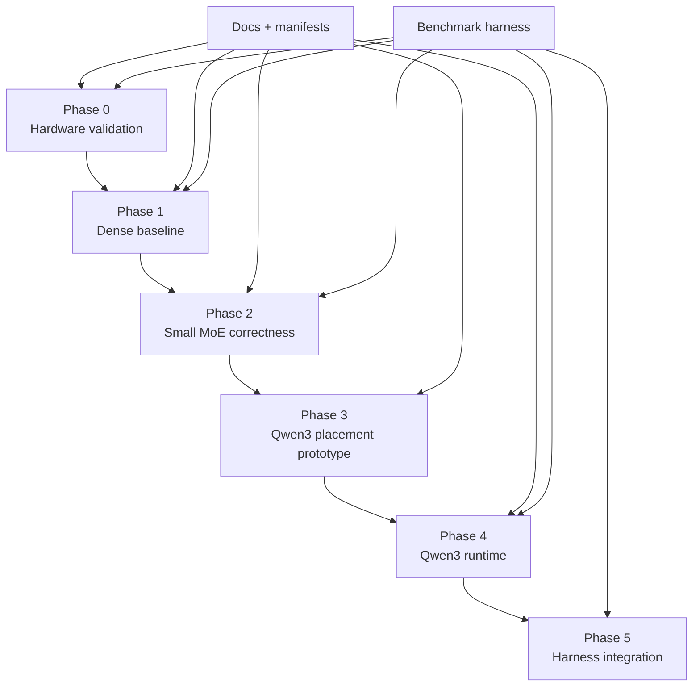

# DS5 Execution Plan Input v0.2: Qwen3-235B-A22B

**Document type:** Planning-mode execution input  
**Status:** Backlog seed  
**Date:** 2026-07-08  
**Target model:** Qwen3-235B-A22B-Instruct-2507

---

## 1. Planning objective

Convert the accepted Qwen3-235B-A22B model decision into an executable plan with explicit workstreams, dependencies, acceptance gates, and deliverables.

---

## 2. Workstream map

---

## 3. Epics

| Epic | Name | Purpose | Depends on |
|---|---|---|---|
| E-001 | Documentation and governance | Lock Qwen3 decision and baseline specs | None |
| E-002 | Hardware measurement harness | Measure TB5, NVMe, Metal, UMA behavior | E-001 |
| E-003 | Model manifest and loader | Parse Qwen3 metadata and quant manifests | E-001 |
| E-004 | Dense distributed baseline | Validate transport, KV, sampling, replay | E-002, E-003 |
| E-005 | MoE correctness harness | Validate top-k routing and expert execution | E-003, E-004 |
| E-006 | Quantization pipeline | Produce tensor-aware quantized artifacts | E-003, E-005 |
| E-007 | Placement simulator | Enforce per-node budgets and expert tiers | E-003, E-006 |
| E-008 | Transport protocol | Activation/result packets and ring buffers | E-002, E-004 |
| E-009 | Metal kernels | Attention, dequant, fused expert kernels | E-004, E-005 |
| E-010 | KV/page manager | Layer-owned KV pages and global index | E-004 |
| E-011 | Qwen3 runtime integration | Run final target path | E-006, E-007, E-008, E-009, E-010 |
| E-012 | Benchmark and observability | Performance/correctness telemetry | E-002 onward |
| E-013 | Agentic harness integration | Tool-call reliability and replay | E-011 |
| E-014 | Release/runbook | Reproducible launch and reporting | E-012, E-013 |

---

## 4. Phase tasks

### Phase 0: Hardware validation

| Task | Output |
|---|---|
| Measure TB5 throughput by message size | `hardware/tb5_results.md` |
| Measure TB5 latency by message size | `hardware/tb5_latency.csv` |
| Measure NVMe sequential throughput with 16/64/128/256MiB blocks | `hardware/nvme_results.md` |
| Measure Metal command-buffer overhead | `hardware/metal_overhead.md` |
| Measure UMA pressure and allocator fragmentation | `hardware/memory_pressure.md` |
| Decide macOS file I/O controls | `ADR-002-storage-io-path.md` |

### Phase 1: Dense baseline

| Task | Output |
|---|---|
| Implement tokenizer/sampler baseline | deterministic token test |
| Implement 2-node and 3-node dense split | dense pipeline benchmark |
| Implement KV page table v0 | KV replay test |
| Implement transport packet checksums | transport correctness test |
| Run dense 32B then dense 70B comparator | baseline report |

### Phase 2: Small MoE correctness

| Task | Output |
|---|---|
| Implement router/gate parity harness | top-k parity report |
| Implement expert execution reference | expert output diff report |
| Implement fused multi-expert kernel v0 | kernel correctness report |
| Implement local/remote expert packet path | packet trace report |
| Run Qwen3-30B-A3B or equivalent MoE | small-MoE acceptance report |

### Phase 3: Qwen3 placement prototype

| Task | Output |
|---|---|
| Parse Qwen3-235B-A22B tensor metadata | model manifest |
| Generate quantization manifest | quant manifest |
| Generate expert placement manifest | placement manifest |
| Simulate per-node memory | placement budget report |
| Load shard skeletons without full decode | load report |

### Phase 4: Qwen3 runtime

| Task | Output |
|---|---|
| Execute short deterministic decode | correctness trace |
| Execute 8K benchmark | performance report |
| Execute 32K benchmark | performance report |
| Run cold-miss stress | placement policy report |
| Tune B/C local router mirrors | latency comparison |
| Tune fused expert kernels | kernel profile report |

### Phase 5: Harness integration

| Task | Output |
|---|---|
| Integrate constrained tool-call decode | tool-call validity report |
| Implement durable state replay | replay report |
| Implement error recovery corpus | recovery benchmark |
| Compare dense baseline vs Qwen final | project finding report |
| Draft public benchmark write-up | publishable artifact |

---

## 5. Definition of done

### Engineering DoD

- Code path is reproducible from documented launch commands.
- All generated artifacts have versioned manifests.
- Benchmark run records model, quant, placement, commit, and hardware metadata.
- Failure mode is logged with enough trace data to reproduce.
- No release task relies on unstated model or hardware assumptions.

### Architecture DoD

- ADR-001 is accepted.
- System architecture v0.2 is the active baseline.
- Runtime placement spec is implemented by manifests.
- Risk register is reviewed at phase boundaries.
- JW4/Gemma scope is archived or split out.

---

## 6. First sprint recommendation

| Priority | Task |
|---:|---|
| 1 | Accept ADR-001 and update document index |
| 2 | Create model manifest schema for Qwen3-235B-A22B |
| 3 | Build placement simulator with static-memory caps |
| 4 | Build Phase 0 hardware measurement harness |
| 5 | Define benchmark run metadata schema |
| 6 | Mark JW4/Gemma as superseded or separate track |

---

## 7. Execution constraints

- Do not start Qwen3 kernel optimization before placement simulation proves memory feasibility.
- Do not start performance routing shortcuts before top-k parity is validated.
- Do not implement generic model plugin abstractions unless required by the selected bring-up targets.
- Do not optimize for 128K+ context until 8K and 32K are stable.
- Do not mix project acceptance criteria from the older Gemma/JW4 brief with Qwen3 DS5 acceptance criteria.
