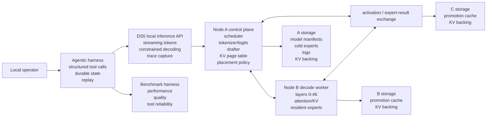
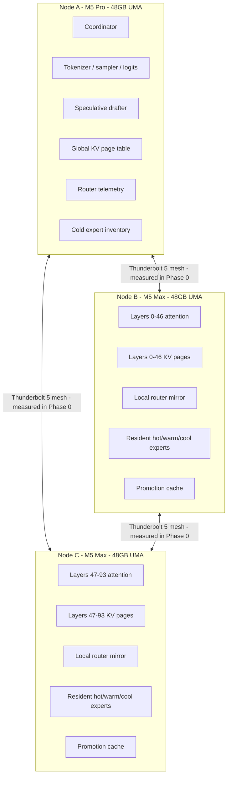
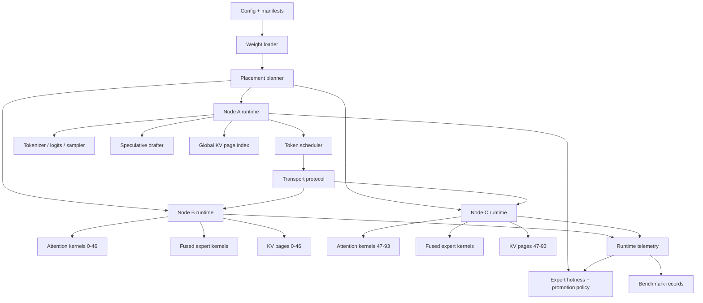
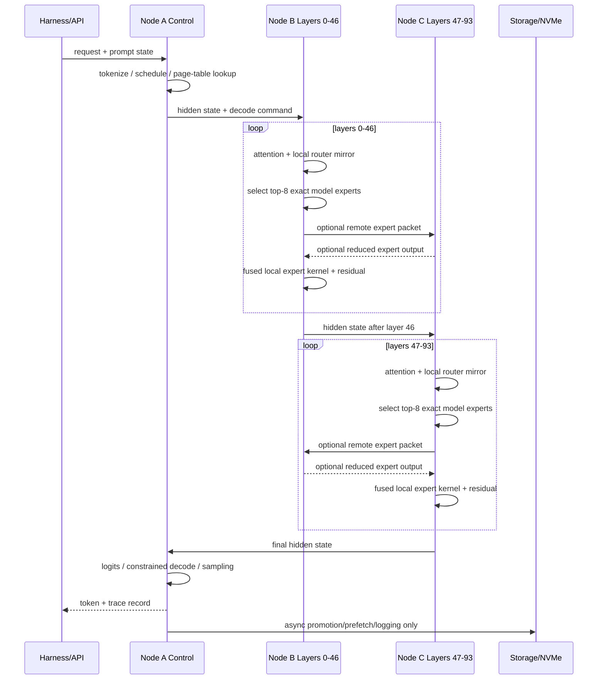

# DS5 System Architecture v0.2: Qwen3-235B-A22B

**Document type:** System architecture specification  
**Status:** Planning baseline update  
**Date:** 2026-07-08  
**Model decision:** Qwen3-235B-A22B is the locked DS5 target model

---

## 1. Architecture summary

DS5 uses a three-node Apple Silicon mesh to run Qwen3-235B-A22B as a sparse MoE model. The architecture separates control-plane duties from decode data-plane duties:

- **Node A** is the control plane: scheduler, tokenizer, sampler/logits owner, drafter host, global KV/page-table owner, telemetry collector, placement policy owner, and cold-expert inventory manager.
- **Node B** is decode worker 1: owns layers 0-46, attention/KV for those layers, local router mirror, resident hot/warm/cool experts, and promotion cache.
- **Node C** is decode worker 2: owns layers 47-93, attention/KV for those layers, local router mirror, resident hot/warm/cool experts, and promotion cache.

The steady-state decode path should be resident in unified memory. NVMe is not used as the normal active-weight path.

---

## 2. Context diagram



---

## 3. Deployment topology



---

## 4. Logical component view



---

## 5. Runtime decode flow



---

## 6. Node responsibilities

| Capability | Node A | Node B | Node C |
|---|---|---|---|
| Tokenizer | Primary | No | No |
| Sampler/logits | Primary initially | Optional later shard | Optional later shard |
| Drafter | Primary | No | No |
| Global scheduler | Primary | Worker endpoint | Worker endpoint |
| Layer attention | Optional validation copy | Layers 0-46 | Layers 47-93 |
| KV cache | Global page table | Pages 0-46 | Pages 47-93 |
| Router/gates | Authoritative copy; policy | Local mirror after validation | Local mirror after validation |
| Hot/warm experts | No, except cold/overflow | Resident | Resident |
| Cold experts | Inventory + compressed source | Promotion target | Promotion target |
| Telemetry | Aggregator | Producer | Producer |
| NVMe | Cold backing/logs/KV backing | Promotion/KV backing | Promotion/KV backing |

---

## 7. Data view

### 7.1 Persistent data classes

| Data class | Location | Durability | Notes |
|---|---|---|---|
| Raw model artifact | External/local model store | Persistent | Reference source; not mutated |
| Quantized weight shards | A/B/C local storage | Persistent | Generated from quant manifest |
| Placement manifest | A primary, B/C copy | Versioned | Defines layer, expert, quant, owner |
| KV page backing | A/B/C storage | Ephemeral or checkpointed | Used for long context and replay |
| Router telemetry | A logs | Persistent for calibration | Hit rate, gate mass, cold misses |
| Benchmark traces | A logs | Persistent | Reproducibility and regression tests |
| Tool traces | Harness store | Persistent | Used for tool reliability benchmark |

### 7.2 Placement manifest schema sketch

```yaml
model: Qwen3-235B-A22B-Instruct-2507
manifest_version: 0.2
nodes:
  A: {role: control_plane, static_cap_gb: 33.6}
  B: {role: decode_worker, layers: [0, 46], static_cap_gb: 33.6}
  C: {role: decode_worker, layers: [47, 93], static_cap_gb: 33.6}
tensors:
  router_gates: {quant: fp16_or_q8, owner: A, mirrors: [B, C]}
  lm_head: {quant: q8_or_q6, owner: A}
  attention:
    layers_0_46: {owner: B, quant: q8_or_q6}
    layers_47_93: {owner: C, quant: q8_or_q6}
experts:
  tier_policy: calibrated_hotness
  hot: {quant: iq3_s_or_q4_k_s, owners: [B, C]}
  warm: {quant: iq2_m, owners: [B, C]}
  cool: {quant: iq2_xs, owners: [B, C]}
  cold: {quant: iq2_xxs, owner: A, backing: nvme}
```

---

## 8. Security and governance view

| Area | Requirement |
|---|---|
| Local-only prompts | Prompt, tool, and state data remain local unless explicitly exported |
| Model artifacts | Verify checksums and quant manifest provenance |
| Tool credentials | Stored outside traces; redacted in benchmark replay artifacts |
| Logs | Trace logs must support redaction and retention policy |
| Reproducibility | Benchmark runs must record model version, quant manifest, placement manifest, git commit, and hardware measurements |
| Change control | Model target changes require a superseding ADR |

---

## 9. Operational view

| Operational signal | Owner | Action |
|---|---|---|
| Per-node static memory | Loader | Refuse launch if >33.6GB unless override is explicit |
| Runtime memory pressure | Node daemon | Throttle context/promotion; emit alert |
| Router/top-k mismatch | Correctness harness | Block release |
| Cold-miss burst | Placement policy | Promote/demote and update heatmap |
| Blocking NVMe read in decode | Runtime tracer | Treat as performance defect |
| Tool-call parse failure | Harness | Log, retry under constrained decode, benchmark |

---

## 10. Architecture principles

1. Narrow model-specific runtime over generic abstraction.
2. Correctness before performance.
3. Exact Qwen routing semantics before locality optimization.
4. Resident hot path before NVMe promotion tricks.
5. Measurement before throughput claims.
6. Mixed precision by tensor criticality, not uniform quantization.
7. Document every model/runtime assumption in versioned manifests.
